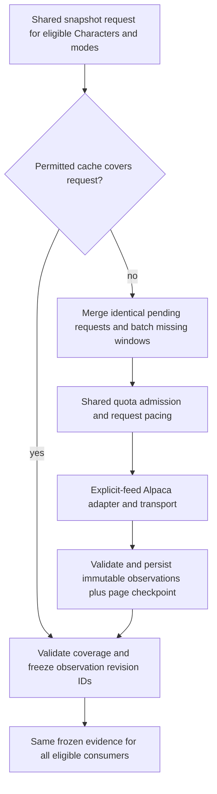

# Shared market-data requests and the Basic-plan budget

Status: required follow-up design, 2026-09-06. The current adapter does **not** implement this shared admission control. TASK-014 owns implementation, TASK-015 owns forward integration, and TASK-016 owns adversarial verification. This update changes the task contracts, not runtime behavior, credentials, vendor selection, or account-use authorization.

## Limit, feed, and quota scope

Alpaca currently lists **200 historical API calls/minute** for the individual-account Basic equities plan. It separately lists IEX real-time coverage and a restriction on the latest 15 minutes of history. These are distinct constraints: staying under the request limit does not grant recent SIP access. See [subscription documentation](https://docs.alpaca.markets/us/docs/about-market-data-api) and the [Market Data FAQ](https://docs.alpaca.markets/us/docs/market-data-faq), checked 2026-09-06. The FAQ permits older historical SIP queries without a subscription when the requested end is at least 15 minutes old; actual account entitlement still needs qualification. Do not silently switch feed or shift the requested time window to make a denied request succeed.

Apply the owner's 200/min maximum to the pilot's Market Data REST requests, conservatively sharing one pool across its market-data endpoints until the account's quota scope is verified. Do not create independent pools per Character, portfolio, symbol, feed, endpoint, run, worker, or API key when those share a provider quota. Identify the configured quota principal with a nonsecret internal ID; credential rotation must not create new allowance.

Market Data and Trading API quotas are separate, as explained by [Alpaca staff](https://forum.alpaca.markets/t/429-rate-limit-exceeded-when-creating-orders/14120). Paper orders, account/assets queries, reconciliation and cancellations use the Trading API policy when that optional adapter exists. Verify its scope separately; do not assume a market-data plan changes it. The partner **Broker API** is a different product, not the personal paper Trading API. Do not infer quota independence merely from different hostnames or credentials.

## Proposed operating policy

- Provider/owner maximum: **200 attempts in 60 seconds** for the pilot Market Data pool; any lower verified constraint wins.
- Initial operating ceiling: **180 attempts in any rolling 60 seconds**, paced at no more than three dispatches/second with no accumulated idle burst. This is a starting engineering setting, not measured account capacity.
- Every outbound HTTP attempt consumes the same operating budget: first pages, later pages, retries, and any metered status or metadata requests. Retries are not allowed to spend a separate extra 20 calls. Failed or ambiguously delivered attempts count conservatively.
- Cache hits, subscribers waiting for the same download, and reads of stored results consume zero provider requests. Every run also has a finite total-attempt budget and a completion deadline; an RPM ceiling alone does not bound total work.
- Review headroom from the bounded authorized sample and observed other-account traffic. Do not increase the 200 ceiling, purchase a plan, or auto-tune toward saturation. Lower headroom usage or defer work when necessary.

The 20-call margin is not a guarantee about unrelated programs. All known callers must use the same coordinator, or have explicit disjoint allocations whose sum respects the operating ceiling. An uncooperative external program can exhaust the provider quota anyway; report that limitation, heed server cooldowns, and fail visibly. A per-process limiter must never be described as account-wide coordination.

## Fetch once, freeze once, distribute many times

Cache lookup and merging happen **before** admission. Admission happens immediately before **every actual transport attempt**, including retry loops and pagination. A hidden SDK retry must either use this admission path or be disabled. A Character never owns Alpaca credentials or calls its transport directly.

Cache identity includes provider, permitted sharing scope, feed, endpoint/data kind, canonical instrument identifiers, timeframe, requested interval, adjustment/as-of settings, and observation revision policy. Merge matching in-flight work so a cache miss requested by three Characters produces one download. Reuse overlapping cached windows; batch the remaining symbols/windows when the endpoint supports it. Do not merge incompatible feeds, revisions, entitlements, or freshness requirements. Raw observations may be shared across experiments only when permitted; frozen snapshots and decision-time eligibility remain experiment-specific.

The [multi-symbol bars endpoint](https://docs.alpaca.markets/us/reference/stockbars) already accepts multiple symbols and sorts by symbol before timestamp. Its page size is a response-wide bound; one busy symbol can occupy early pages. Batch where appropriate, but account for every page and verify the complete requested universe before freezing. Stopping at a page budget is `deferred` or `incomplete`, not proof the remaining symbols had no data. Resume tokens must be bound to the entire canonical query, not only feed. Commit page contents and checkpoint together; a lost response may require a metered refetch, but must not duplicate observations.

Do not promise a fixed number of calls from symbol count alone. Estimate missing pages plus retry allowance and compare with the run budget/deadline; actual admission remains authoritative. Identical consumers share the work item and its request charge. Attribute physical attempts once to that work item; per-run references must not multiply account usage in reports. A subscriber joining ongoing work does not mint allowance or reset the work item's retry cap.

## One coordinator before multiple workers

For the local pilot, use one request-owning coordinator and durable private state with an exclusive quota-owner lock. All manual commands, sample collectors, heartbeats and later scheduled jobs submit work to it. A second owner must connect to it or fail closed; independent processes cannot each start with 180 requests. Reuse the existing Python/SQLite infrastructure rather than introduce a distributed service before it is needed.

Record dispatched attempts, cooldown deadlines, queue/work IDs, query hashes and committed page checkpoints durably. Do not hold database write transactions while sleeping or making HTTP calls. Serialize actual dispatch admission; a delayed permit must not be hoarded and released as a burst. On crash, conservatively count uncertain attempts. Restart must recover recent usage and cooldown, or wait a full safe window if state is unavailable. Use a monotonic clock for in-process pacing and conservative recovery from persisted wall times; backward/forward clock changes cannot refill the budget or cancel cooldown early.

Persist completion/deferred/failed status and distinguish waiting for quota from stale data, no observations and entitlement failure. Waiting does not revise the original evidence cutoff. If the complete snapshot cannot arrive before its deadline, abstain/defer for affected decisions under the existing completeness policy; never give later Characters additional observations within the same comparison or backdate delayed decisions.

## Retry behavior to correct

Inspection of the adapter at commit `29238ee` found bounded retry counts and page checkpoints, but `_request` has no proactive shared admission, `sleeper` defaults to a no-op, and `_delay` takes the minimum of a numeric `Retry-After` and a 30-second cap. Thus “honors Retry-After” is only true for the tested small value, not for long server cooldowns. HTTP-date values, case-insensitive lookup, nonfinite numbers, jitter and cross-caller cooldown behavior are not established by the current tests. The resume record also lacks validation against the full query identity.

TASK-014 must provide a real production wait/defer path; fake clocks/sleepers are explicit offline-test dependencies. Normalize header names. Accept valid finite nonnegative numeric and HTTP-date `Retry-After` values and relevant reset headers where verified for the endpoint; invalid values use bounded exponential backoff with jitter. Do not assume Broker API header guarantees apply to Market Data.

Persist a shared not-before deadline after throttling, including when the affected work item exhausts its retries. Wait at least the server-required delay; cap our fallback backoff, not the server cooldown. For a server delay longer than the run's wait allowance, checkpoint and return deferred with a resumable time instead of sleeping indefinitely or retrying early. Resume and every retry must reacquire both quota and work-budget admission. Rate headers may tighten admission; a higher reported limit must not override the configured owner ceiling. No entitlement retry loop, feed fallback, or invented missing bar.

## Ownership and release order

| Task | Required responsibility |
| --- | --- |
| 014 | Own shared admission, pacing, cache/in-flight merging, batching, query-bound resume, real waits, retry/header handling, durable quota state and telemetry |
| 015 | Extend frozen run manifests with quota policy ID, work/request budget, deadline, expected coverage and snapshot ID; route all research consumers through 014 |
| 016 | Perform an offline rate-control preflight before account calls; later complete the broader forward/paper readiness audit |
| 017 | Reuse shared frozen market evidence; independently meter any paper Trading API calls and reconcile ambiguous orders before retry |
| 020 | Submit manual/scheduled work to the same coordinator, prioritize fresh decision-critical data over background backfill, and bound starvation/queue age |
| 021 | Forecast quote/trade volume; narrow cadence/universe or use eligible streaming with separately verified connection/subscription limits; metered REST repair still applies |
| 022 | Reuse stored market windows around disclosures; disclosure-source quotas stay independently configured |
| 018, 019, 023 | Read stored results; no Alpaca client, credentials, or provider calls in ordinary exports, social summaries or reviews |

Tasks 001/002/006/010/013 supply the existing schema, persistence, ingestion, heartbeat and CLI interfaces. Extend those interfaces as deliverables of 014/015, using migrations and updated tests; do not create independent limiters in those earlier tasks or rewrite their historical completion evidence.

Release sequence: **014 control implementation → 016 offline rate preflight → 014 authorized sample/qualification → 015 account-backed forward work → 016 final readiness review → 017 paper operation**. The narrow 016 preflight requires the new 014 control code and existing fixture controls from 015, not a completed real forward window or vendor selection. This phased gate avoids a dependency cycle. The final 016 review still requires the full forward prerequisites. Nothing here authorizes account access or starts a sample.

## Required adversarial evidence

Use fake clocks and recorded transports rather than rate-limit stress against Alpaca:

1. Concurrent Characters, modes, adapter instances and manual/scheduled processes obey the shared rolling-window and pacing limits, including minute boundaries and restart. Duplicate ownership fails closed.
2. The same missing request has one fetch sequence and one physical charge; an eligible cache hit has none. Different feed/adjustment/cutoff requests cannot cross-contaminate snapshots.
3. Every page, retry, transport ambiguity and SDK attempt is counted. A multi-symbol fixture with a later symbol on page two cannot produce a false complete opportunity set after page one. Changed-query resume is rejected.
4. Numeric `Retry-After: 120`, HTTP-date, lowercase headers, missing/invalid/NaN/infinite headers, exhausted retries and reset hints produce correct wait/defer states. No caller dispatches through a shared cooldown; a production configuration cannot silently use the no-op test sleeper.
5. Kill/restart during wait, dispatch, page commit and checkpoint recovery preserves budget and idempotence. Clock jumps cannot permit a burst.
6. Run budget/deadline exhaustion produces visible queue delay, incomplete coverage and abstention/defer reasons. All paired consumers retain the same eligible snapshot; no fabricated historical decision appears on catch-up.
7. Provider metrics reconcile physical dispatches, retries, 429s, cache hits, merged subscribers, queue/wait duration, pages committed, coverage, deadline misses and remaining budget. Secrets and raw credentials never appear in manifests/public exports.
8. Separate Market Data and paper Trading policies are exercised without accidental double budgets for one real quota. Export/notebook/review fixtures reject any attempted Alpaca transport access.

The authorized sample later checks real endpoint entitlement, observed headers, small-workload throughput and headroom under the limiter. It is a bounded validation sample, not a load test. Record measurements and remaining external-caller uncertainty before claiming account-ready operation.
