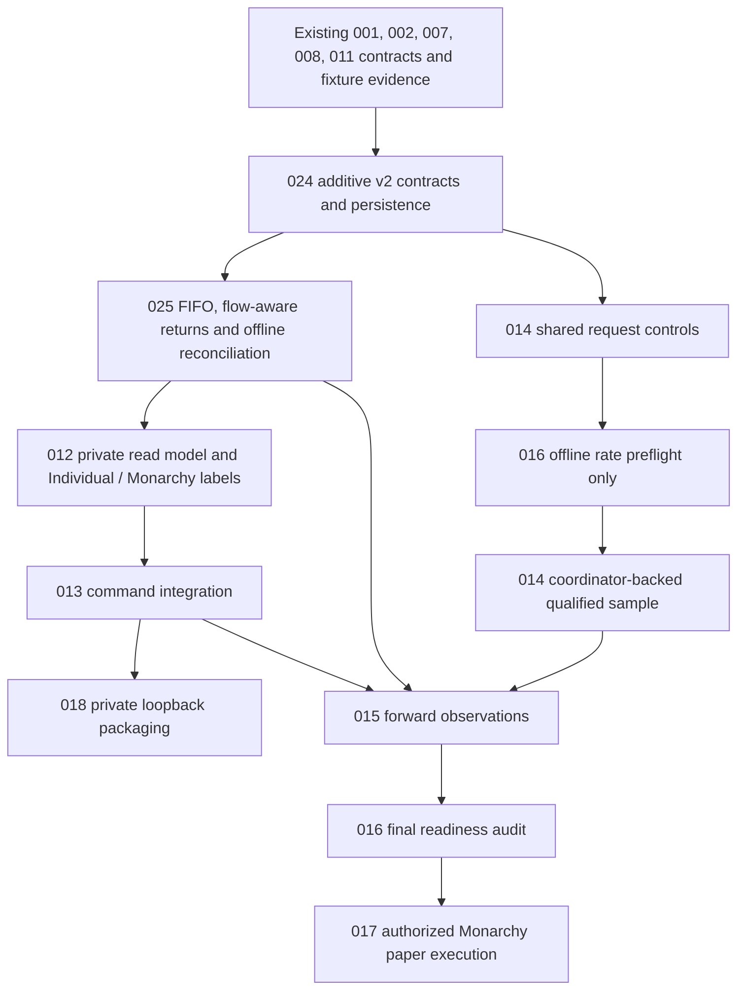

# META-001 impact and execution record

> Subsequent queue refactor (2026-09-06): [ordered remaining work](../tasks/README.md) now starts at Step 01. Original TASK references below remain stable historical/contract references; [the crosswalk](../tasks/CROSSWALK.md) gives their active steps.

Date: 2026-09-06. Audit baseline: `7681a34` on main. Status: architecture review executed; validation results are recorded below. No account, model, paper-order, paid-plan or deployment operation was performed.

## Outcome and improvements

The owner-approved local/private direction can reuse the existing fixture observatory. The earliest affected contract is TASK-001's v1 record schema, followed by persistence and portfolio projections; a cosmetic rename at TASK-012 would not fix accounting. [TASK-024](../tasks/TASK-024-high-Sol.md) is the exact next implementation task, followed by [TASK-025](../tasks/TASK-025-high-Astra.md). [START-HERE](../tasks/meta-tasks/START-HERE.md) gives prerequisites, files, commands and stop conditions.

META-001 was strengthened to prioritize prospective economic evidence, distinguish decision skill from execution assumptions, include distribution receivables, preserve actual stored mode identifiers and separate reference-test success from production migration. These are refinements within approved architecture; no new blocking owner approval was needed to execute this review.

## Verified findings

| Artifact inspected | Actual finding | Decision / migration effect |
| --- | --- | --- |
| [schema.py](../src/trade_theorist/schema.py), [contracts.py](../src/trade_theorist/contracts.py) | Operational v1 mode is `character_portfolio` (singular), with `council`; portfolio contains initial cash but no full typed lots/flow-aware read model | **Preserve** strings/v1; **add** versioned production contracts through 024. Plural wording in the approval was documentation drift |
| [storage.py](../src/trade_theorist/storage.py), existing SQL migrations | Immutable records, hash-chained events, transactional/idempotent commands and migration checksums already exist. Event payloads can be open-ended | **Preserve** storage design; **amend** typed v2 payload validation and append-only projections. No old migration/record rewrite; untyped fields denied public export |
| [simulation](../src/trade_theorist/adapters/trader_user_sim/__init__.py) `State.apply`, `Simulator.setup` | Average-cost proportional basis relief, initial-only funding, reservations and ex-date dividend receivable/payment already exist; runtime correction support is limited | **Preserve** proven v1 mechanics/results; **add** FIFO/partial-fill/flow/correction projection in 025. Do not falsely report v1 as FIFO |
| [risk.py](../src/trade_theorist/risk.py) and simulator reporting | Independent governor and freshness/halting controls already exist; changing funding changes relevant denominators | **Preserve** authority; **amend** v2 flow handling without silently resetting losses or halts |
| [evaluator](../src/trade_theorist/evaluate/__init__.py) `series_metrics`, `register_trial` | Net return uses final equity divided by initial cash; comparison hashes include mode. Existing metrics suit the declared v1 no-external-flow scope, not arbitrary contributions or matched cross-mode claims | **Preserve** v1 evidence; **add** exact TWR, flow-neutral drawdown and explicit execution-basis comparison in 025 |
| [export.py](../src/trade_theorist/export.py) | Public-summary-v1 strips raw bars but emits holdings quantity/value and equity/history; these can reconstruct information. Private evidence labels do not themselves withhold all report values | **Amend now:** restrict v1 exporter to synthetic stores/outputs. **Add later:** a separate private read-model contract in 012/018 |
| [dashboard assets](../src/trade_theorist/dashboard/index.html), [CLI](../src/trade_theorist/cli.py) | Existing two-tab fixture dashboard, six answers, schema/hash checks and loopback demo serve are reusable. Current fixture labels remain Council/Character portfolios. No full private v2 server/origin contract exists yet | **Preserve** UI/browser evidence; **amend** presentation in 012 and commands in 013; **replace/add** hardened packaging in 018 |
| [Alpaca adapter](../src/trade_theorist/adapters/alpaca_market_data/__init__.py), [forward gates](../src/trade_theorist/forward/__init__.py), [ADR-003](../decisions/records/ADR-003-alpaca-market-data-qualification.md) | Small authorized delayed SIP check is recorded historically; shared limiter remains pending. No routine account-ready operation follows from that check | **Preserve** feed/quota/rights gates and bounded-sample evidence; **amend** v2 integration references in 014/015 |
| Tasks 016/017 | Broader readiness review and submission adapter remain future work; client IDs alone cannot isolate broker cash/positions | **Amend** 016 evidence requirements and 017 Monarchy-only attribution; preserve separate paper authorization |
| Task 018 | Public Pages was planned and paused, never delivered | **Retire** its public deployment outcome; **replace** with local/private packaging under the same stable ID |
| Tasks 019–023 | Social views, scheduler, specialist research, disclosures and later governance are separate bounded work | **Preserve** substance; **amend** output/identity/comparison assumptions. No implicit Alpaca requests or curriculum changes |

Original completion records for 001–013 remain historical evidence. New follow-ups are explicit; dates and old test results are not overwritten. No private database was opened or migrated for this audit. Inspected implementation, tests and checked-in synthetic records are sufficient to identify the gaps.

## Revised dependency structure

The repeated 014/016 nodes are distinct phases, not circular task prerequisites. Full task dependency metadata remains acyclic; narrow preflight work uses available fixture code. A local synthetic UI does not wait for vendor rights or full paper readiness. Ordered Character learning can continue independently. The roadmap retains 001–023 and adds only two bounded repair tasks, 024/025.

## Profit-oriented evidence sequence

1. Prove accounting and data eligibility on deterministic fixtures. A deposit, double-paid dividend, missing quote or mixed broker balance must not create a false edge.
2. Freeze the eligible Character versions, opportunity set, horizon, sample/stopping rules, baselines, costs and matched execution basis before forward outcomes. Record all trials and failures. Long-horizon Characters are not penalized merely for waiting.
3. Measure marginal value of advice with matched no-mail/bounded-mail variants; do not equate more messages, unanimous agreement or more completed books with profit. Keep specialist identity and independent initial opinions.
4. Show recurring data/inference cost beside attributable after-trading-cost P/L. Distinguish one-time research cost and hypotheses about future live scaling. Avoid optimizing a metric that can be improved merely by injecting capital or omitting expenses.
5. Review calibration, drawdown, excess return, uncertainty, regime coverage and operational reliability on the approved cadence. Paper results and changed Character versions remain labeled. Insufficient prospective evidence leaves promotion undecided; earning leadership does not authorize live capital.

These measures operationalize the existing goal. They do not promise profit, impose a trading quota or change owner risk limits. UI convenience and private packaging support inspection; they are not substitutes for an out-of-sample test.

## Deliverable and evidence boundary

| Deliverable | Completed here | Still pending |
| --- | --- | --- |
| Meta-task improvement and audit | Revised META-001, this impact report and phase diagram | No unbounded implementation campaign |
| Architecture | [ADR-004](../decisions/records/ADR-004-local-observatory.md), approved interpretations and stable mode spelling | Runtime private v2 integration |
| Rights | [matrix](data-rights-matrix.md) plus 632 declared-field classifications; unknown fields default deny | Provider-specific retention/replay/model-processing evidence and private read-model enforcement |
| Performance/attribution | [versioned contract](portfolio-performance-v2.md), closed synthetic schemas, hand-worked vectors and executable reference tests | Actual persistent v2 implementation, owner-data migration and broker submission |
| Current publication protection | Fixture-only legacy export guard and regression tests, including misleading fixture flag | New private exporter/server; UI label update |
| Task graph | 012–018 amendments, downstream follow-ups, new 024/025, [START-HERE](../tasks/meta-tasks/START-HERE.md) | Completion of those implementation tasks |
| Approvals | Approved defaults applied; no blocking new owner choice for this review | Existing later-stage data rights, risk limits/operator assignments and paper/live gates |

## Validation

Focused reference-contract and export regressions passed. The full `scripts/check.py` run passed **154 tests across 19 modules** in 22.4 seconds; complete logs remain in ignored `.local/test-logs/`. `scripts/export_field_classification.py --check` passed for **632 declared fields**. Both new JSON Schemas passed Draft 2020-12 schema validation. All **25 task dependency lists** are acyclic and agree with the index; local Markdown targets and anchors passed validation, as did Git whitespace checks.

Tests use original synthetic data and recorded transports; they do not measure market performance or run account traffic. Current HTML/JS assets are unchanged, so no new browser-rendering claim is made. No source books, credentials, account identifiers or licensed samples were added to Git. The only executable production change is the fixture-only export boundary; the reference reducers deliberately remain outside the production engine.
