# A small ecology of investment minds

Status: implementation design, 2026-09-05. No engine or measured results exist yet. Start with the measures below, build one observable cycle, then refine the model from evidence.

## Purpose, boundary, and vocabulary

The purpose is to discover whether distinct, source-grounded reasoning improves decisions after costs and risk, while making each Character's development understandable. Trading frequency, message count, and monthly profit are observations, not goals to maximize.

Donella Meadows distinguishes accumulated **stocks**, rates of **flow**, **feedback**, and **delays**. Her account also emphasizes information access, rules, goals, and paradigms as places to intervene. See the official [systems-thinking resources](https://donellameadows.org/systems-thinking-resources/) and [Leverage Points](https://donellameadows.org/archives/leverage-points-places-to-intervene-in-a-system/). *Thinking in Systems: A Primer* is listed by its [publisher](https://www.penguinrandomhouse.com/books/801035/thinking-in-systems-by-donella-meadows/). The project-specific model below is our design interpretation, not a quotation or a claim that Meadows prescribed a trading architecture.

The boundary contains learning, evidence storage, discussion, recommendations, simulated execution, evaluation, and owner controls. Markets, publishers, vendors, and future real-money execution sit outside it. Market observations enter as information; they do not enter as capital. Price changes revalue existing positions without creating cash inflows. Information can be copied between Characters; unlike cash, it is not conserved.

## First measurement dictionary

| Stock or state | Unit / definition | Inflow or increasing influence | Outflow or decreasing influence | First observation |
| --- | --- | --- | --- | --- |
| Evidence backlog | Count of validated, unprocessed observations | Accepted observations/session | Processed or expired observations/session | Count, oldest age, rejected fraction |
| Usable evidence | Count of observations eligible at decision time | Validation and indexing | Expiry or supersession from active view | Coverage, freshness, missing timestamps |
| Character knowledge | Versioned beliefs and theories; counts are inventory, not intelligence | Accepted learning deltas | Retirement from active memory | Source coverage, contradictions, checkpoint age |
| Open questions | Count of unresolved decision-relevant questions | New questions/session | Answered or expired questions/session | Oldest age, due-time backlog |
| Unread mail | Count per recipient | Delivered messages/session | Read/expired messages/session | Delivery delay, unread age, duplicate rate |
| Pending decisions | Count awaiting resolution | Candidate admission/session | Final recommendation or abstention/session | Decision latency, missed deadlines |
| Cash | Fictional USD per portfolio | Sales, distributions, explicit funding | Purchases and cash costs | Available and reserved cash |
| Holdings | Shares per instrument per portfolio | Filled buys and share actions | Filled sells and share actions | Quantity, exposure, mark age |
| Unsettled forecasts | Count with unresolved horizon | Committed forecasts/session | Matured or invalidated forecasts/session | Horizon and sample coverage |
| Usage allowance | Remaining run tokens / requests | Explicit run allocation | Model calls and retrieval | Used versus cap, retries, cost when known |

Record flows per heartbeat and per market session so changing heartbeat frequency does not manufacture growth. Archive events rather than deleting history when active stocks decline. Confidence, equity, drawdown, and evidence quality are derived measures, not interchangeable units of knowledge or cash.

For a backlog, `next_count = prior_count + admitted - completed - expired`. For cash, `next_cash = prior_cash + sales + distributions + funding - purchases - cash_costs`. Equity is cash plus marked holdings; purchases exchange cash for holdings. Slippage changes the fill price and must not also be charged as a duplicate cash fee.

## Flow and information structure

```mermaid
flowchart LR
    M[Market observations and public sources] --> I[Scripted ingestion and validation]
    I --> E[(Versioned evidence store)]
    B[Permitted books in curriculum order] --> L[Sequential learning]
    L --> K[(Character knowledge versions)]
    E --> S[Freeze decision-time snapshot]
    K --> S
    S --> O[Independent initial opinions]
    O --> Q[(Questions and mailbox events)]
    Q --> D[Bounded discussion]
    D --> F[Final recommendation or abstention]
    F --> G[Independent deterministic risk gate]
    G --> P[Trader User simulation adapter]
    P --> C[(Cash, holdings, immutable ledger)]
    C --> V[Outcome and baseline evaluation]
    F --> V
    V --> R[Scheduled learning and governance review]
    R --> L
```

This is a flow-of-information map, not a calibrated stock-and-flow simulation. Storage nodes represent accumulations; arrows elsewhere mean information transfer rather than money transfer. Portfolio accounting supplies the actual conservation equations.

## Feedback hypotheses to test

| Loop | Proposed causal chain | Likely delay | Control / observable |
| --- | --- | --- | --- |
| B1: risk restraint, balancing | Loss or exposure rises → gate restricts new exposure → risk-taking falls | Each proposed action; marks may lag | Rejection reasons, freshness, limit breaches |
| B2: inquiry, balancing | Uncertainty rises → focused question → relevant evidence → uncertainty may fall | One discussion round or later session | Answer usefulness, confidence change, latency |
| R1: learning, reinforcing | Better evidence → better tests → more useful knowledge → better evidence selection | Forecast horizon plus review cycle | Calibration and out-of-sample results; improvement is a hypothesis |
| R2: echo, reinforcing | Agreement raises confidence → more reuse of agreeing sources → more agreement | Several sessions | Shared-source fraction, opinion convergence, independent-first control |
| R3: winner favoritism, reinforcing | Recent win → more attention or capital → more visible wins → apparent superiority | Weeks or months | Equal research budgets, fixed review dates, all failures retained |
| B3: discussion capacity, balancing | Queue age rises → admission/scope shrinks → queue drains | Heartbeats | Queue age, deadlines, token cost, expired questions |

Signs indicate hypothesized directional effects while other factors are held constant. They are not empirical causal estimates. Increased disagreement can prevent expensive mistakes or delay valuable actions. Fewer trades can increase net return. Never resolve either ambiguity by rewarding agreement or a minimum trade count.

## Delays and leverage choices

Track event-to-publication, publication-to-ingestion, ingestion-to-opinion, mailbox response, recommendation-to-fill, forecast-to-outcome, and outcome-to-review delays separately. An intraday thesis may expire before a good answer arrives. A value thesis may remain untestable for months; a daily heartbeat must not turn it into a daily trading mandate.

Use a small parameter set first: one discussion round, fixed deadlines, and capped context. Larger interventions change who sees initial opinions, which objections require answers, who can overrule whom, or what earns leadership. The highest-level project choice is to reward testable, after-cost decision quality rather than constant activity. Preserve distinct schools and permit explicit forks when foundations change.

## Draft evaluation and refinement

The initial design has three likely weaknesses: backlogs can grow faster than reading capacity; discussion can homogenize specialists; learning feedback can arrive long after a portfolio loss. Address them with expiry and admission limits, independent first opinions, and hard risk rules that do not wait for learning.

Run matched no-mail and bounded-mail experiments using the same snapshots, budgets, frozen Character versions, and costs. First add queue age, decision latency, source overlap, and recommendation-change rate. After forecast horizons mature, compare calibration, missed opportunities, avoided losses, and net performance. A changed recommendation is not automatically an improvement; counterfactual fills have their own assumptions.

At scheduled reviews, adjust one structural choice at a time and preregister the next window. If mail increases latency without useful evidence, route only targeted objections. If a dominant voice erases diversity, hide peers' opinions until independent submissions are committed. If stale evidence drives abstentions, repair ingestion before changing personalities. Never rewrite earlier scores after changing the model.

See [architecture](architecture.md), [discussion protocol](discussion.md), and [evaluation](evaluation.md) for implementable contracts.
