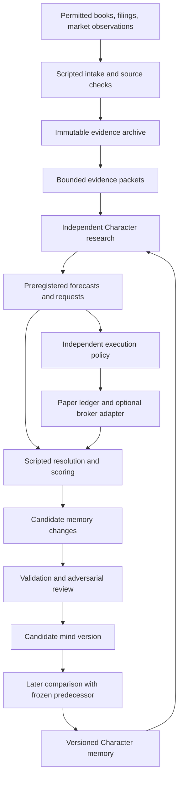

# Design: a laboratory for learning investment theories

**Proposal, September 15, 2026. Written before ADAPTED_DESIGN.md.** This is the design I would choose if the only inherited requirement were to train theorists and test their reasoning against the world. It does not change the current operating policy, authorize a new scheduled run, or implement any of the capabilities below.

## 1. What we are building

A Character is a versioned collection of beliefs, methods, memories, and open questions that a model can use to perform research. The product is a laboratory for improving those beliefs through contact with reality. Books introduce explanations; observations constrain them; forecasts put them at risk; outcomes suggest revisions; later experiments test whether the revisions helped.

The most important output is a defensible statement such as:

> This Character narrowed a theory after a failed prediction. Its revised version subsequently made better forecasts than its frozen predecessor on the same new cases, within this scope and with this uncertainty.

Portfolio performance is another output. A theory can be informative without producing a trade, and a profitable trade can have an incorrect explanation. Neither an eloquent retrospective nor a rising portfolio establishes that the Character learned.

The current implementation and examples of what the Characters know are documented separately in [CURRENT_STATE.md](CURRENT_STATE.md). This design proposes external memory learning, not model weight training. Inspectable state includes the model/runtime version, prompt, retrieved context, source vintages, and policy as well as the Character's files. Saved outputs can be replayed exactly; generating the same answer again is not guaranteed.

## 2. Three kinds of additional evidence

| Dimension | What to increase | What does not establish progress |
| --- | --- | --- |
| Volume | Resolved, preregistered observations with known denominators, missing cases, and uncertainty | Repeating the same event in more sessions or collecting more words |
| Diversity | Different mechanisms, conditions, horizons, sectors, failures, and credible rival explanations | Many correlated stocks or overlapping forecasts counted as independent trials |
| Context | Relevant facts that let a Character distinguish explanations: fundamentals, expectations, publication timing, costs, positioning where available | Sending the entire archive to a model or treating every added source as reliable |

Maintain an evidence coverage table for each theory: cases attempted, cases resolved, independent episode groups, horizons, conditions covered, source quality, and important conditions still unseen. A long quiet bull market does not become evidence about crashes merely by generating more forecasts.

Separate three research lanes:

1. **Study:** ordered reading, historical examples, and exploratory questions. Historical model knowledge may contaminate apparent forecasting success; label it as retrospective study.
2. **Prospective tests:** freeze the question, information cutoff, selection rule, forecast, and scoring rule before the outcome is available.
3. **Paper operation:** execute selected recommendations with fictional capital to test implementation, costs, and the consequences of decisions. Preserve unselected recommendations and abstentions too.

Study can generate a new hypothesis at any time. Confirmation requires subsequent evidence that was not used to invent or repair it.

## 3. What it means to test reasoning

Ask: **What observation would make this explanation more credible than its strongest rival?** A forecast can be consistent with the Character's theory, or it can specify the surprising result that would count against it. Both belong in the same preregistration. The aim is discriminating evidence, not an equal number of bullish and bearish calls.

A test card contains:

- The theory version, scope, premises, causal steps, and strongest plausible rival.
- The particular uncertain claim under examination. Distinguish empirical claims from accounting identities, definitions, and owner risk preferences.
- Observable predictions under both explanations; probabilities or ranges where appropriate.
- A primary outcome, source, information cutoff, resolution time, scoring rule, and missing-data rule.
- A mechanism observation as well as any price outcome. For example, a predicted change in cash generation is distinct from a predicted stock return.
- What would weaken, qualify, split, or retire the claim. Unexpected results are not automatically decisive falsifications of probabilistic claims.
- Case selection, dependence groups, benchmark, costs, and the number of alternatives already explored.

### Examples tailored to the schools

| Character | Useful test | Evidence that challenges it |
| --- | --- | --- |
| Index Steward | For genuinely comparable exposures, forecast the after-cost tracking difference; separately test whether a proposed active departure earns its incremental cost and risk | An exposure mismatch explains the apparent fee effect; or a prospectively chosen specialist repeatedly adds value after matched costs and risk |
| Value Rationalist | Forecast a business quantity over its appropriate reporting horizon, then connect the range to conservative value and the price already paid | Normalized earnings were overstated, debt or dilution consumed the expected value, or improving fundamentals were already fully priced |
| Systematic Trend Operator | Freeze a complete entry, sizing, and exit rule; compare its outcomes across persistent trends and reversals | Apparent success disappears after costs, correlated exposures, or all searched variants are included; whipsaws exceed the preregistered tolerance |
| Future Event/Disclosure Character | Predict the response following public disclosure, conditional on attention and competing company news | Similar moves occur without attention, start before publication, or are explained by a concurrent earnings event |

These are proposed test families, not validated strategies. The Index Character need not forecast tomorrow's direction to test a cost argument. The Value Character needs business evidence. Trend losses do not individually refute a system designed to tolerate many small losses.

### Worked example: learning from a failed disclosure forecast

A Character proposes: "New attention to a prominent filer's purchase causes a short-lived response." A rival says: "Company news explains both the attention and the price movement."

Before a qualifying filing becomes an experiment, freeze eligibility, publication/observation cutoff, attention measure, company-news exclusions or strata, response horizon, controls, and predicted probabilities. Do not choose the filing because its subsequent return looks interesting.

Suppose the predicted response fails to occur. The outcome record says that the forecast failed under its exact resolution rule. The learning proposal might say: "The attention threshold was met, but the predicted response was absent; reduce confidence in this scoped claim." It cannot silently add a new condition and mark the original forecast correct. Alternatively, a missing attention feed may make the mechanism test unresolved while the price forecast still resolves.

Conversely, a rising price without the predicted attention sequence can score as a correct price forecast while failing to support the proposed mechanism. Publication, measured attention, then price movement is still observational evidence; it does not by itself prove imitation caused the move.

### Overlap and diversity

Use nonoverlapping outcome windows within an instrument/theory/horizon for the primary confirmatory stream when practical. Preserve overlapping forecasts as a separate monitoring stream; they may reveal how beliefs respond to new information. Record overlap and common-event/factor groups in both streams. Different tickers on the same market day are not automatically independent.

Never present a raw forecast count as an effective independent sample size. Use dependence-aware uncertainty estimates only when the study supports them; otherwise disclose the small number of episode groups. Choose sample requirements from the question, horizon, effect of interest, and uncertainty, rather than treating 30 resolutions as universal sufficiency.

For perspective, 29 sequential, nonoverlapping five-session forecasts require 145 future sessions on one stream. More instruments can add evidence in parallel but do not manufacture independence. Quarterly business hypotheses may require several quarters. Time is part of the experiment, and the roadmap must say so.

## 4. Architecture

The execution policy cannot be rewritten by a Character's research response. Sources are data, never instructions to grant tools. Characters submit structured requests; deterministic services enforce scope, timing, rights, and budgets.

### Core records

| Record | Essential contents |
| --- | --- |
| Evidence | Stable ID, source and locator, content hash, event time, publication time if known, first observed time, permitted uses, corrections, extraction uncertainty |
| Belief | Claim and type, scope, premises, supporting and opposing evidence, confidence rationale, dependencies, unresolved tensions, review trigger |
| Mind version | Parent version(s), constitution, module hashes, evidence cutoff, model/prompt configuration, creation and activation times |
| Experiment | Competing predictions, selection rule, outcome contract, benchmark, overlap groups, budget, stop/review conditions |
| Forecast | Experiment and mind versions, exact evidence packet, probability/range, authored explanation, timestamp, resolution contract |
| Outcome | Observation vintage, calculation, adjudication status, score, missing/censored reason, correction lineage |
| Memory proposal | Exact operations on prior beliefs, evidence references, rationale, alternatives, reviewer findings, disposition |
| Research request | Question, desired observation, affected theory, resource estimate, deadline, source permissions, lease, decision receipt |

An authored explanation is a concise research rationale, not a claim to expose a model's hidden internal reasoning.

## 5. A Character's memory

The durable mind is larger than any one prompt. The working mind is the bounded portion loaded for a particular question.

| Layer | Purpose | Update policy |
| --- | --- | --- |
| Constitution | Research identity, methods, preferences, recurring biases | Rare, explicit version change; hard owner constraints live outside it |
| Core belief map | Most useful claims and their relationships | Small, reviewed; retains significant tensions |
| Theory modules | Detailed assumptions, mechanisms, tests, and failures for a family of questions | Update only when relevant evidence changes |
| Entity modules | Current state and open questions about a watched business, fund, filer, or sector | Bounded capsule plus linked dated episodes |
| Episodes | Full forecast, decision, abstention, observation, critique, and outcome history | Append-only archive; corrections link to originals |
| Work queue | Unresolved forecasts, requested evidence, pending reviews, stale modules | Script-maintained state derived from durable events |

Shared entity facts and Character interpretations are different objects. All Characters may see the same filing vintage; Value and Trend should not silently inherit each other's conclusions. Independent initial opinions precede any peer discussion. Cross-school learning cites the source school and creates an explicit belief change.

Each packet records exactly which modules and evidence excerpts were loaded, their versions, and why. Retrieval failures are inspectable. A relevant fact somewhere in the archive is not treated as knowledge that the Character actually used.

### Can a book be flashed into a consolidation?

Yes, as a compact entry point with retrievable modules. No small summary preserves every argument, example, exception, or possible future use. Store an original, cited synthesis of reusable mechanisms and limitations; retain lawful source access and detailed reading checkpoints for targeted rereading. Test the compact memory with held-out questions requiring assumptions, counterexamples, and application to new situations.

The first book still shapes interpretation. A later book can extend or challenge it. A merged or differently ordered curriculum becomes a separately named experiment. A constitution should encourage a recognizable method without making empirical beliefs immune to correction.

## 6. Consolidation is a reviewed transformation

It is not merely "summarize the latest conversation." It has explicit inputs, permissible edits, loss checks, and an activation decision.

### Inputs

1. The exact parent mind manifest and affected modules.
2. A bounded batch of new source claims and learning deltas.
3. Matured forecasts and their original predictions, evidence packets, outcomes, and benchmarks.
4. New corrections, contradictions, abstention reasons, and observations relevant to those claims.
5. The strongest relevant prior support and counterevidence, retrieved by stable links.
6. The memory budget and unresolved questions that the new version must preserve.

The full archive remains available through retrieval. It is not reread at each consolidation. If the batch cannot be reviewed within the budget, it is divided and queued; urgent source corrections can quarantine affected beliefs immediately by script.

### Process

1. **Resolve first.** A deterministic outcome service applies the preregistered contract. Ambiguous outcomes go to recorded adjudication, not discretionary self-grading.
2. **Attribute the error.** Separate faulty facts, failed premises, incorrect mechanism, timing, normal probabilistic variation, execution costs, and measurement failure. "No justified change" is valid.
3. **Propose a patch.** Add, qualify, weaken, split, retire, or link beliefs. Include the exact before/after text, affected dependencies, evidence IDs, and an alternative interpretation.
4. **Check structure.** Validate references, source permissions, timestamps, numerical qualifiers, scope, module size, and append-only history. Multiple articles about one filing remain one underlying event.
5. **Challenge the patch.** A separately prompted reviewer checks overreaction, convenient exceptions, missing counterevidence, unsupported causality, and damage to other claims. A model reviewer is a check, not an independent source of truth.
6. **Test the compact memory.** Use source-grounded probes: explain a limitation, find a contradiction, identify an invalid application, recover supporting evidence, and respond to a source withdrawal. Compare answers before and after compression using equivalent information access. Human spot checks inspect claims, not just another model's approval.
7. **Create a candidate.** Save immutable new modules and a parent-linked manifest. Failed or deferred proposals remain in the archive.
8. **Activate for a declared experiment.** The candidate can make new shadow forecasts. Compare it with the frozen predecessor on later common evidence before calling the change an improvement or promoting it into a decision role.

The outcome that motivated an edit cannot also be the held-out proof that the edit worked. Keep the old version running on a small common sample, or allocate fixed comparison windows within the same overall model budget.

### What survives compression?

Retain information that changes decisions across cases: a mechanism, scope boundary, invalidation condition, recurring failure, calibrated uncertainty, important numeric assumption, or unresolved contradiction. Retain provenance and the strongest adverse evidence even when inconvenient. Distinguish "the book argues X" from "our evidence supports X."

Illustrative patch: "Breakouts predict gains" becomes "This specific breakout rule remains a hypothesis; the observed reversal episode weakened its proposed applicability under condition C, while other conditions remain untested." The system must not invent C after seeing the loss and call it a confirmed discovery. C is a new hypothesis for future tests.

Archive repetitive detail and completed episodes behind links. Do not discard failed predictions, selected-versus-unselected cases, denominators, or qualifications to make a cleaner story. Confidence is a scoped judgment supported by measurements where available, not a fabricated precise posterior. Formal probability updates require an explicit likelihood model and dependence assumptions.

Compression is lossy. Its quality must be measured by retrieval and reasoning probes, not by how concise or persuasive the resulting prose appears.

## 7. Versioning, forks, and Git

Use a content-addressed version graph: manifests identify the exact constitution, modules, source vintages, and parent versions. Record both when a fact applies and when the system learned it, with separate activation times. Preserve amendments and later corrections rather than replacing historical source data.

Git is useful for reviewed textual constitutions, public original book syntheses, proposed patches, and version manifests. Private evidence and permitted private memories belong in private storage with verified backups; a private Git repository is optional where source permissions allow it. Public Git must not receive raw licensed data, private portfolio information, or restricted derived summaries. A hash can identify a private artifact without publishing it. Git alone does not enforce source permissions or knowledge cutoffs.

One can branch from any older mind and assimilate new evidence differently. Label that as a new learning experiment with its actual creation date. A branch using information learned later cannot claim that the old Character predicted history. Likewise, recorded external memory does not erase knowledge already present in a base model.

Rollback changes the active manifest; it does not erase losing forecasts, spent budget, or source withdrawals. A withdrawal index prevents old versions and summaries from silently resurrecting quarantined evidence. Version comparisons include model and prompt changes so that improvements are not automatically attributed to memory.

## 8. Bounded routine operation

Scripts collect permitted observations, deduplicate them, update numerical features, mark modules stale, resolve outcomes, and maintain counters. AI wakes for a bounded research question or a scheduled review. Quiet periods may consume no model calls.

### An initial budget, not a measured usage forecast

For three Characters and a five-session week:

| Work | Maximum calls | Input ceiling per call | Output ceiling per call |
| --- | --- | --- | --- |
| Daily research | One per Character per session: 15/week | 6,000 tokens | 1,000 tokens |
| Weekly consolidation | One proposal and one review per Character: 6/week | 8,000 tokens | 1,500 tokens |
| Total | 21/week | 138,000 tokens/week | 24,000 tokens/week |

The maximum priced token cost is `0.138 * input_price_per_million + 0.024 * output_price_per_million`, plus any separately declared provider charges. This is a proposed reservation envelope, not a current provider quote. Provider accounting, including any billed reasoning tokens, must fit the reservation or the call is inadmissible. Book-reading campaigns, additional council calls, and version comparisons either replace work inside this envelope or require a separately visible allocation; they are not free extras.

Start with at most six active entity modules across the three Characters, and a small fixed number of retrieved modules per packet. Hard token limits take precedence over convenience. A fixed-size core, selected modules, bounded recent evidence, and response reservation must fit before a call starts. Do not truncate away critical qualifiers; defer the question or narrow its scope.

An illustrative 6,000-token input allocation is: 1,000 for constitution, 800 for core beliefs, up to three 800-token modules, 1,200 for new evidence, and 600 for instructions and metadata. These are initial design ceilings to validate with real packets. A complex question may require a separately budgeted study call. Module counts and summaries are constrained by the total packet ceiling, not added on top of it.

### Why cost does not have to grow with archive size

- Update only changed modules from new deltas. Keep per-source ingestion cursors and incremental aggregates.
- Give each watched entity a size-limited current capsule, structured rolling statistics, and pointers to dated episodes. Its summary must not grow forever.
- Use indexes to retrieve a bounded number of candidates. Search, storage, and indexing still have costs; bounded prompts do not make the database constant-time.
- Expire inactive watch leases. Cold modules stay retrievable but are absent from routine prompts.
- Give compaction a fixed maintenance budget. If incoming work exceeds capacity, expose the backlog and defer low-priority work.
- Reserve calls and tokens before dispatch; save request hashes, completion receipts, and uncertain-charge states. Crashes must not create unbounded paid retries.

This bounds routine AI work with respect to accumulated history **only while active coverage and admitted workload are bounded**. Watching an unlimited number of new stocks with equal depth requires more resources. The UI should show that tradeoff rather than conceal it.

## 9. Characters can request capabilities

A Character begins with no watchlist if appropriate. It can request: "Watch this issuer's next two filings because leverage is the unresolved premise in theory V-7. Stop after the second filing or on this date."

The request includes the question, relevant theory, rival predictions, desired source, observation frequency, expected decision impact, duration, resource ceiling, and stopping condition. A policy service returns granted, deferred, declined, or needs-owner-decision with a reason and receipt.

Requests within existing source permissions and finite budgets can be granted automatically. A new paid source, new data destination, unrestricted recurrence, or live-capital action needs its own authority. Arbitrary code execution, credential access, and policy modification are not research-request types. New capabilities require implementation and verification before a request can use them.

Deduplicate common factual requests across Characters, preserve separate interpretations, and give each Character a fair minimum research allocation. Extra capacity follows declared information value and study coverage, not the most confident prose. Every grant has a lease, maximum work, and expiration; the owner can stop it.

## 10. Public disclosures as evidence

The useful vocabulary is **congressional financial disclosures / Periodic Transaction Reports (PTRs)**, **corporate insider ownership filings (Forms 3, 4, and 5)**, and **institutional investment-manager holdings reports (Form 13F)**. These describe different populations and different observations.

| Source family | What it offers | Research consequence |
| --- | --- | --- |
| House/Senate disclosures | Covered personal/family financial interests and reported transactions; ownership attribution must follow the actual filing | Research public reporting and subsequent attention; do not assume the named official personally chose every transaction |
| SEC Form 4 | Reported transactions by covered corporate insiders | Separate open-market purchases/sales from awards, gifts, exercises, and other transaction types |
| SEC Form 13F | Periodic holdings of covered investment managers | Study disclosed holdings changes; do not reconstruct exact personal trades or a complete portfolio from them |

House covered transactions above $1,000 generally have a deadline at the earlier of 30 days after notice or 45 days after the transaction. Filing deadlines are not reliable publication timestamps. [House Ethics guidance](https://ethics.house.gov/periodic-transaction-report-calculator/).

Most Form 4 transactions are reported within two business days. Form 13F generally arrives within 45 days after quarter-end and does not disclose short equity positions. These delays make the three families unsuitable for a single "famous person traded now" feed. [SEC insider bulletin](https://www.investor.gov/introduction-investing/general-resources/news-alerts/alerts-bulletins/investor-bulletins-69), [SEC Form 13F FAQ](https://www.sec.gov/rules-regulations/staff-guidance/division-investment-management-frequently-asked-questions/frequently-asked-questions-about-form-13f).

There is a concrete source-use dependency: Senate guidance prohibits specified uses of financial disclosure reports, including commercial purposes except the stated news/media exception. Do not assume a trading research application qualifies. Review the actual intended use and source conditions before congressional intake; unresolved permission blocks that source family, not the whole laboratory. SEC-source qualification can proceed separately. [Senate public-access and use guidance](https://www.ethics.senate.gov/public/index.cfm/financialdisclosure).

### Cohort and linkage plan

1. Define separate cohorts for elected officials, corporate insiders, and institutional managers. Select using recorded criteria for prominence, filing coverage, and research relevance at the selection date, before evaluating subsequent returns. Include less-prominent or lower-attention comparison cases. Do not choose only famous winners.
2. Register stable filer and issuer identities, security mappings, ownership labels, transaction codes, ranges rather than invented exact amounts, amendments, and mapping uncertainty. Keep unresolved mappings out of automatic signals.
3. Preserve transaction date, filing/acceptance time, known publication time, first local observation, and amendment times separately. Unknown public availability is an interval or unknown value. A prospective Character can use only evidence actually available to its run.
4. Join the filing to permitted market observations, point-in-time company facts, competing news, and an independently qualified attention measure. A disclosure alone cannot measure imitation. If the attention feed is unavailable, mark the mechanism study blocked or narrow the claim.
5. Link the resulting evidence IDs to the original forecast packet and later outcome. Corrections append new vintages; they never rewrite what the Character saw.
6. Compare preregistered attention and fundamental explanations, matched controls, and placebo windows. Control construction and exclusions must be fixed before evaluating results. Observational confounding remains visible.

Start with one source family and one question. SEC submissions and company-fact interfaces are useful infrastructure, not an automatic source of market prices or congressional reports. Respect source-specific access policies, caching, identification, and limits. The official sites were researched for this proposal; automated retrieval and usable attention coverage have not been qualified here. [SEC APIs](https://www.sec.gov/search-filings/edgar-application-programming-interfaces), [SEC developer resources](https://www.sec.gov/about/developer-resources).

The system studies reported actions and competing explanations. It does not claim to know a filer's motives or infer wrongdoing from a trade.

## 11. Paper trading and evidence gates

Paper trading supplies execution and decision evidence: order handling, sizing, turnover, exposure, costs under stated assumptions, and what happens when advice becomes a portfolio. It cannot reproduce every live fill or market impact, and it does not replace non-price reasoning tests.

Use separate gates:

1. **Engineering and source gate:** correct accounting, bounded resources, permitted inputs/model processing, failure recovery, risk checks, and inspectable forecasts. Passing this permits a finite research run.
2. **Research maturity gate:** enough appropriate prospective evidence, diversity, and uncertainty analysis for the particular claim. Passing this permits stronger conclusions or a declared scope expansion, not automatic live deployment.
3. **Decision-role gate:** comparative evidence and policy review before a candidate mind controls a larger paper role or council leadership.
4. **Live-capital gate:** a separate future decision with its own requirements.

An internal paper ledger can run during evidence gathering after gate 1. A broker paper adapter is optional and has additional order/reconciliation tests. Forecasts can remain unresolved while the engineering works. Keep fixed baselines and frozen predecessor comparisons on matched information and opportunities. Treat improved learning, better calibration, and portfolio utility as separate scorecards.

Use proper probability scores, such as binary Brier loss `(probability - outcome)^2`, alongside calibration, coverage, and benchmark comparison. Small samples cannot support confident calibration curves or reliable rankings. [Gneiting and Raftery, 2007](https://sites.stat.washington.edu/people/raftery/Research/PDF/Gneiting2007jasa.pdf).

## 12. Explicit construction and evidence programme

Every blocking condition gets an owner, next action, evidence of completion, and recheck date. "Wait for more evidence" is not an implementation task.

| Stage | Work and exit evidence | Owner / dependency |
| --- | --- | --- |
| N0: study charter | Choose three Characters, one evidence family, one primary question, source/model-processing permissions, finite budget | Owner decides scope; implementer documents executable contracts |
| N1: evidence and mind records | Immutable archive, knowledge cutoffs, source policy, version graph, bounded retrieval, backup/restore | Implementer; N0 |
| N2: actual research runtime | Tools-free structured Character calls, bounded packets, independently committed opinions, reservations and replay | Implementer; N1 and permitted model route |
| N3: outcome-to-memory loop | Preregistered forecast, resolution, candidate patch, critic, loss checks, future parent/candidate comparison | Implementer; N2; fixture trials prove mechanics only |
| N4: paper and operations | Internal ledger, matched baselines, risk veto, finite runner, recovery and quiet no-op behavior | Implementer; N1–N3 |
| N5: finite real study | Dated observations and due outcomes collected; coverage/backlog/remaining horizons reported | Operator; N0–N4 engineering gate; actual time must pass |
| N6: review and next lease | Evaluate uncertainty and learning, retire weak claims, approve a finite next study if useful | Research reviewer; N5; insufficient evidence can be the result |
| N7: extensions | Broker paper integration, additional sources, books, specialists, and larger watch coverage as separate bounded studies | Implementer/operator; explicit requests and capacity |

At N5 start, register each forecast's due date and observation source. The operator runs scripted collection on a finite schedule and resolves outcomes after their horizons. Missed observations create a repair task; expiring studies create a review task; unavailable prerequisites name a responsible decision. No calendar session or observation is generated merely by completing a coding step.

Learning from environmental feedback through external memory has precedents in [Reflexion](https://arxiv.org/abs/2303.11366); reflection and retrieval appear in [Generative Agents](https://arxiv.org/abs/2304.03442). Those studies motivate architectural experiments. They do not demonstrate that this system will learn valid investment theories or earn excess returns. Our test is the prospective comparison above.

## 13. What would count as success?

- A fresh process reconstructs the exact declared mind and input packet from a manifest.
- A Character can explain a book-derived claim and its limits, then make a relevant prospective prediction.
- A failed prediction remains visible and can yield a specific, reviewed change rather than a rewritten story.
- A new version is compared with its frozen predecessor on later evidence; null or negative learning results remain publishable.
- Memory probes detect lost qualifications, retrieval misses, and stale or withdrawn evidence.
- With the same active watchlist and budgets, a larger archive does not increase the routine model-token envelope.
- A useful research request can become a finite observation lease, and denied or delayed requests remain understandable.
- Paper outcomes, theoretical insight, and research maturity are reported separately.

This is a larger rebuild. The [adapted design](ADAPTED_DESIGN.md) applies the same learning loop to the existing repository and defines a comparable first milestone, bounded scope, and development-time estimate.
